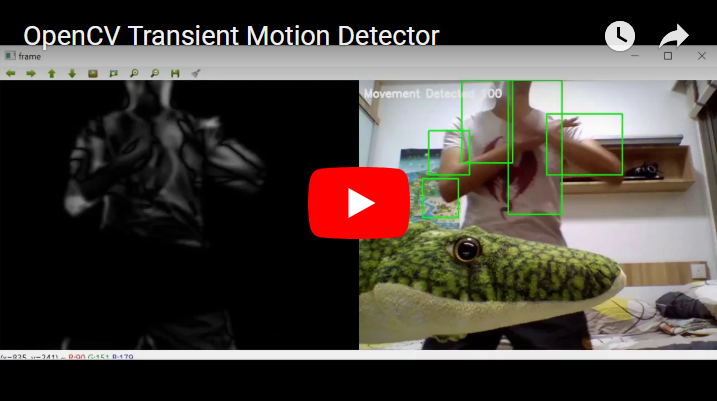

# OpenCV Motion Detector

This project demonstrates an OpenCV-based motion detection application, deployable on multiple platforms. It leverages the power of Intel OpenVINO and NVIDIA Jetson for enhanced performance. The application is containerized using Docker, ensuring seamless deployment and scalability.

[](https://youtu.be/z_X5PFkaPwY)

Reference: <https://github.com/methylDragon/opencv-motion-detector>

## Quick Start

You can easily launch the application on various platforms using Docker with the following steps.

## Intel OpenVINO

```bash
# Build and run the container on Intel platforms.
docker-compose -f docker-compose-intel-openvino.yml build
xhost +
docker-compose -f docker-compose-intel-openvino.yml up
```

## NVIDIA Jetson

```bash
# Build and run the container on Nvidia Jetson platforms.
docker-compose -f docker-compose-nvidia-jetson.yml build
xhost +
docker-compose -f docker-compose-nvidia-jetson.yml up
```

## Development

### Prerequisites

- Python (tested with 3.7)

### Installation

Install Python packages.

```bash
python3 -m venv .venv
source .venv/bin/activate
python3 -m pip install -U pip setuptools wheel
python3 -m pip install -r requirements.txt
python3 -m pip install -r requirements-dev.txt
```

Install pre-commit hooks into Git.

```bash
pre-commit install
pre-commit install commit-msg
```
